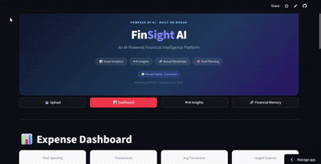

# FinSight AI 💡

## AI-Powered Financial Intelligence with Blockchain-Preserved Financial Memory

> Built using IBM Bob · Made by Kavya Raval

FinSight AI transforms raw expense data into actionable financial insights using AI analytics, while creating a privacy-first financial history anchored on the Monad Testnet blockchain.

Instead of only tracking expenses, FinSight AI helps users understand spending behaviour, receive personalized recommendations, and preserve their financial journey.

---

## 📸 Demo

<!-- Add your project GIF / screenshots here -->



---

# ✨ Features

| Feature | Description |
|---|---|
| 📤 Expense Upload | Upload CSV transactions with automatic validation and categorization |
| 📊 Smart Dashboard | Interactive analytics for spending categories, merchants, and trends |
| 🤖 AI Insights | Spending personality, financial insights, recommendations, and goal planning |
| 📄 Invoice Intelligence | Extract expense details from PDF receipts using IBM watsonx.ai |
| 🔗 Financial Memory | Generate AI snapshots and securely anchor them on Monad Testnet |

---

# 🚀 Quick Start

### 1. Clone Repository

```bash
git clone <repository-url>
cd finsight-ai
```

### 2. Create Environment

```bash
python -m venv .venv
```

Activate:

**Windows**
```bash
.venv\Scripts\activate
```

**Mac/Linux**
```bash
source .venv/bin/activate
```

### 3. Install Dependencies

```bash
pip install -r requirements.txt
```

### 4. Configure Environment

Create `.env`:

```env
OPENAI_API_KEY=your_key_here
```

> The application includes AI fallbacks and can run without an API key.

### 5. Run Application

```bash
streamlit run app/main.py
```

---

# 🔄 How It Works

```
User Financial Data
        ↓
CSV Transactions / PDF Invoices
        ↓
Data Processing + AI Analysis
        ↓
Dashboards + Insights + Recommendations
        ↓
Financial Memory Snapshot
        ↓
Monad Testnet Blockchain
```

---

# 🔗 Blockchain Integration

FinSight AI uses a privacy-first blockchain approach.

Instead of storing sensitive financial data on-chain:

✅ AI creates a financial snapshot  
✅ Snapshot is converted into a SHA-256 hash  
✅ Only the hash is stored on Monad Testnet  

No transaction details, amounts, or personal financial information are stored publicly.

---

# 🛠️ Tech Stack

**Frontend**
- Streamlit

**Data & Visualization**
- Python
- pandas
- Plotly

**AI**
- OpenAI API
- IBM watsonx.ai

**Blockchain**
- Solidity
- Web3.py
- Monad Testnet

---

# 📁 Project Structure

```
├── app/
│   └── main.py              # Main Streamlit application
├── services/
│   ├── expense_service.py   # Data processing & analytics
│   └── ai_service.py        # AI insights & recommendations
├── blockchain/
│   ├── blockchain_service.py
│   └── FinSightAI.sol       # Smart contract
├── finsight-ai/
│   ├── app.py               # Invoice intelligence app
│   ├── doc_processing.py
│   └── model_gateway.py
├── data/
├── assets/
├── requirements.txt
└── README.md
```

---

# 🌱 Future Improvements

- Bank account integrations
- Multi-month spending analysis
- Predictive financial forecasting
- Budget alerts
- Financial milestone tracking

---

Built using IBM Bob · Made by Kavya Raval · FinSight AI · 2026
